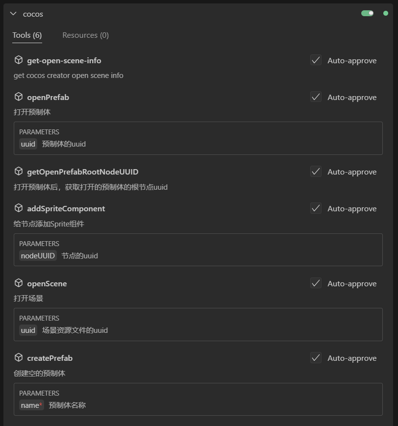

# cocos-mcp tools

使用AI指挥cocos creator做游戏，该仓库提供了部分编辑器能力tools的具体实现。

- [安装配置cocos-mcp](./readme.zh.md)
- [编写自己的第一个MCP插件](https://mp.weixin.qq.com/s/Ger1T-iY6h2lQACNEtiErA)

目前实现的tools:

因为cocos creator编辑器的API提供的能力非常弱，需要自己开发很多整套的接口。

比如我打开了哪个prefab，从打开的prefab中查找节点，给找到的节点添加指定的组件，也就是最基本的整套增删改查的API都非常弱。

说实话开发难度还是比较大。