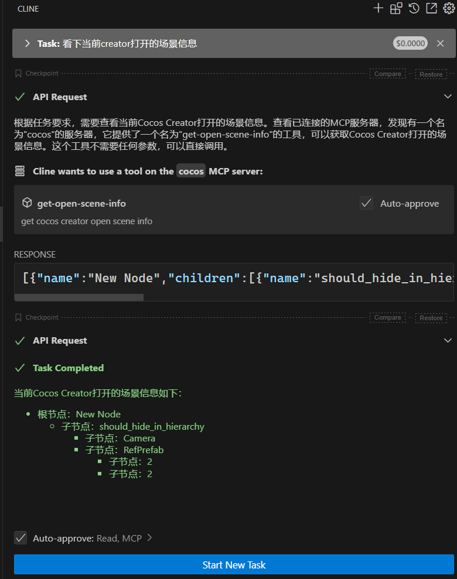
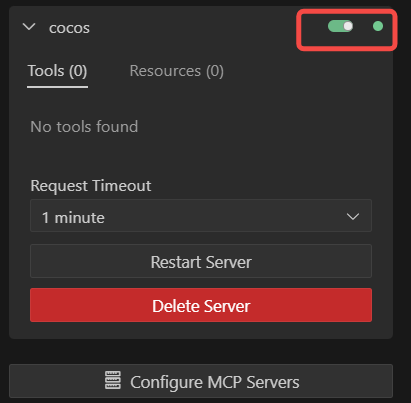

最近MCP的确火热了一把，我亲自体验了下，感觉还真的能够带来实质性的工作效率提升，这里就和大家分享下我的CocosMcp探索过程


## 先看效果
我在CocosCreator编辑器中打开了如下的Prefab，


然后我问AI，帮我查询下当前打开的场景信息，很快AI就通过MCP，正确查询到了我打开的预制体节点树信息




以上仅仅是一个示例，说明的确是可以通过MCP，我们和AI沟通交流，通过MCP去进行一些工作，这个工作流至少是没有问题的。


## cocos-mcp架构特点
cocos-mcp支持开发者开发自己的mcp，接入到AI Clinent中使用，后续会出教程：如何开发自己的第一个cocos mcp插件。

## 使用教程

跟着我一步一步配置这个工作流程吧。

###  第一步：配置支持MCP的AI Client

主流的有cursor、windsurf、vscode等，这里我使用的是`vscode+cline`的组合。
1. 下载安装nodejs，并全局安装[cocos-mcp](https://www.npmjs.com/package/cocos-mcp)
    > npm i cocos-mcp -g
2. 下载安装vscode
3. 在vscode中安装cline插件
4. 打开cline的mcp server配置

    

5. 将如下配置粘贴到cline的mcp配置文件中
    ```json
    {
        "mcpServers": {
            "cocos": {
                "command": "cmd",
                "args": [
                    "/c",
                    "cocos-mcp"
                ]
            }
        }
    }
    ```
6. 修改完毕后，cline会自动刷新mcp-server，正常情况下如图
    

    如果遇到一下报错，是因为本地端口5395被占用导致
    
    
    
    需要结束掉占用5395端口的进程即可
    
    
 
> 这一步的配置只需要配置一次即可，后续不会发生变化。

### 第二步：下载支持cocos-mcp的Creator插件 
AI Cline配置完毕后，你会发现`Tools`为0


这是因为具体的Tools实现是在creator插件里面。

1. 下载该插件，并安装到项目中，同时启用该插件，目前仅支持creator3x，只在creator3.8.1测试通过，其他版本未经过测试。

    

2. 我们回到cline中，这里需要禁用再启用下cocos-mcp，才能看到Tools，因为cocos-mcp的tools是动态获取的，当你卸载了该插件，tools也会随之被卸载。这里仅仅是为了方便你看到cocos-mcp的具体tools，只要保证插件正常安装启用，就能够保证mcp正常调用到。

    

## 最后
至此，所有的cocos-mcp配置环境就完成了，这里深入聊一点，mcp的能力强弱，跟2个因素至关重要：
1. AI的task推理拆解能力
    
    如果AI都不知道使用哪个MCP，就是MCP提供的Tools再强大，也无法发挥作用。
2. MCP提供的Tools能力

    简单说就是一些具体功能的处理能力，比如创建Prefab，修改Prefab等，如果Tools提供的能力有限，同样也不能完成复杂的任务，所以我在设计cocos-mcp的时候，就考虑到了这一点，允许开发者自己编写cocos mcp插件，提供更多的Tools给cocos mcp调度。

通俗点就是：AI通过大模型，思考推理出来应该怎么做，然后再看下MCP提供的Tools，然后将每一步的工作内容交给Tools去完成，因为Tools是处理特定工作内容，比之前的通用大模型的运行结果更加准确，所以总体的使用体验会更佳。

cocos-mcp，让游戏开发更简单，期待更多的开发者提供更多的mcp插件。

## 联系作者 
- 邮箱 xu_yanfeng@126.com
- 微信号 xu__yanfeng

    
 

## 购买须知 
本产品为付费虚拟商品，一经购买成功概不退款，请支付前谨慎确认购买内容。   